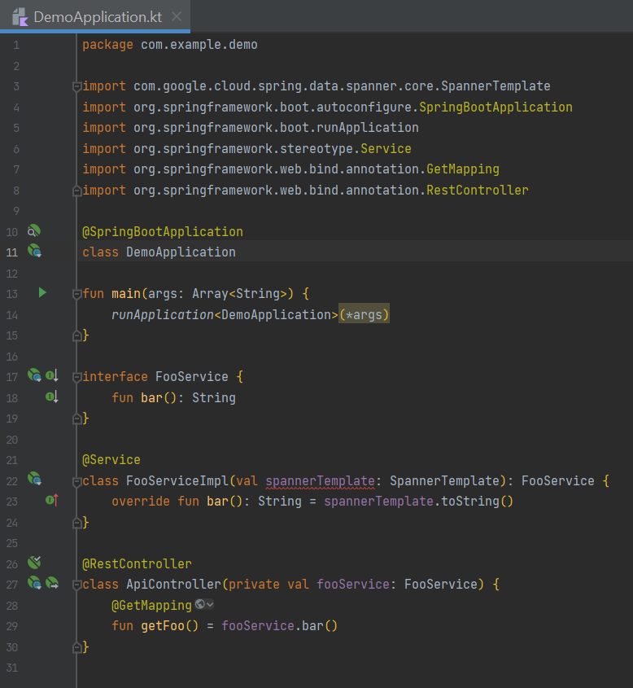
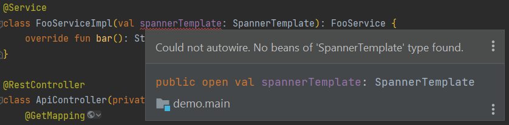

# spanner-template-bean-not-found

Repo to demonstrate the "Could not autowire. No beans of 'SpannerTemplate' type found." message in IntelliJ IDEA.

Editor screenshot:

Error popup on `spannerTemplate` bean:

The errors are false positives. The application starts normally with the SpannerTemplate bean being successfully injected. You can test it by opening the browser on http://localhost:8080.
